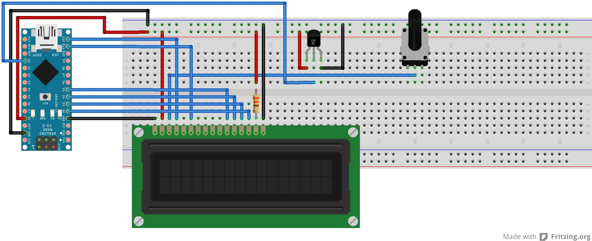

# Arduino-Java-temperatura-hora-mensaje

Mostrar en  pantalla LCD temperatura, hora y navegabilidad entre mensajes enviados desde una interfaz de Java
=============================================================================================================

Versión del proyecto:  1.2   18/04/2018

El objetivo del proyecto es mostrar en una pantalla LCD la temperatura, hora y los mensajes enviados desde una interfaz de Java pudiendo navegar entre los mensajes enviados, desde el más antiguo al más reciente. 

Material:
---------
•	Arduino NANO
•	Cables de conexión
•	Controlador LCD L2c
•	Sensor LM35
•	Pantalla LCD 16x2
•	Potenciómetro
•	Protoboard

Herramientas utilizadas:
------------------------
•	Arduino IDE version 1.8.2
•	NetBeans IDE version 8.2

Características Arduino NANO
----------------------------
El Arduino Nano es una pequeña y completa placa basada en el ATmega328 (Arduino Nano 3.0) o el ATmega168 en sus versiones anteriores (Arduino Nano 2.x) que se usa conectándola a una protoboard. Tiene más o menos la misma funcionalidad que el Arduino Duemilanove, pero con una presentación diferente. No posee conector para alimentación externa, y funciona con un cable USB Mini-B.

Características Controlador LCD L2c
-----------------------------------
El Módulo adaptador LCD a I2C es un Expansor de Entradas y Salidas digitales controlado por I2C. Por el diseño del PCB este módulo se usa especialmente para controlar un LCD Alfanumérico.

Características del sensor LM35:
--------------------------------
El sensor LM35 el cual nos mide una temperatura de -55ºC a 150ºC y una precisión de 0.5ºC a 25ºC; este sensor es suficientemente completo, se puede utilizar para realizar pequeños inventos o proyectos y que pueden ser realizados en casa.

Librería Panamahitek
--------------------
Para poder obtener la conexión entre los IDE de Arduino y Java se utilizó una librería llamada Panamahiteck, la cual trata de una compilación de métodos que permite enviar y recibir datos entre Arduino y un programa hecho en Java. La librería crea automáticamente la ruta C:/JavaRXTX (sólo en Windows), donde almacena estos archivos y los pone a disposición de nuestra aplicación. En la versión 2.8.0 se ha reemplazado la librería RXTX en favor de Java Simple Serial Connector y se ha agregado compatibilidad para sistemas operativos Linux, Mac y Solaris, además de Windows.

Diagrama
--------

El siguiente código muestra la manera en que se realizó la conexión entre NetBeans y Arduino.

public ArduinoGUI() {
try {
//Se inicia la comunicación con el Puerto Serie
ino.arduinoTX("COM7", 9600);     
} catch (ArduinoException ex) {
Logger.getLogger(ArduinoGUI.class.getName()).log(Level.SEVERE, null, ex);
}        
}

Proyecto realizado por:
-----------------------
Veronica Minerva Becerra Avalos
14240592@itleon.edu.mx
Instituto Tecnológico de León

